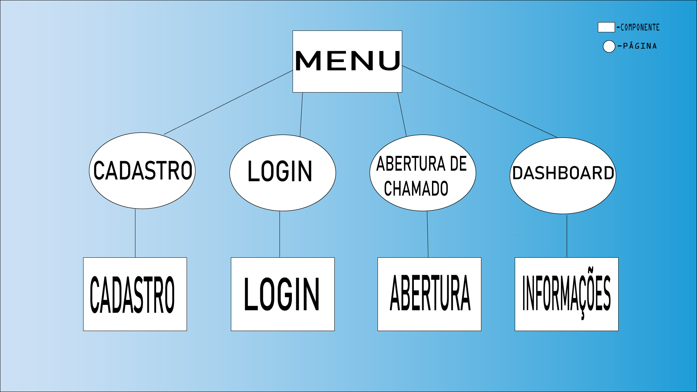

# DIAGRAMA DE COMPONENTES
Um diagrama de elementos, também conhecido como diagrama de blocos ou diagrama de componentes, é uma representação gráfica que ilustra a estrutura ou composição de um sistema, processo ou objeto. Ele é usado para mostrar as diferentes partes constituintes de um todo e como essas partes se relacionam entre si.

Esse tipo de diagrama é amplamente utilizado em várias áreas, como engenharia, arquitetura, ciência da computação e design de sistemas. Ele pode ser aplicado para representar sistemas físicos, como máquinas e dispositivos eletrônicos, bem como sistemas abstratos, como aplicativos de software, redes de computadores e fluxos de trabalho.

Os diagramas de elementos são úteis por várias razões. Eles fornecem uma visão geral da estrutura de um sistema, permitindo que as pessoas compreendam as diferentes partes e como elas se relacionam. Essa representação visual facilita a comunicação e o entendimento entre diferentes partes envolvidas no desenvolvimento ou na análise de um sistema.

Além disso, os diagramas de elementos podem ser usados para identificar componentes-chave, analisar a funcionalidade do sistema, identificar dependências e interações entre os elementos, identificar pontos de falha ou gargalos e auxiliar na resolução de problemas.

Em resumo, um diagrama de elementos é uma representação visual que mostra a estrutura e a composição de um sistema, processo ou objeto, auxiliando na compreensão, análise e comunicação de informações complexas.

